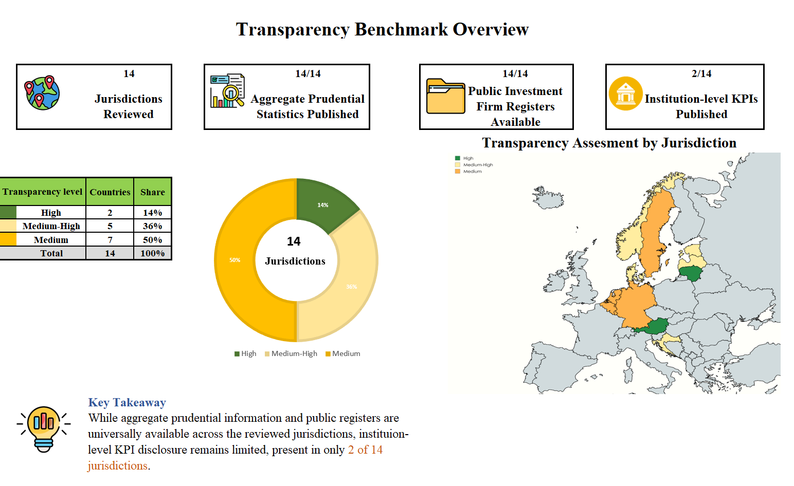
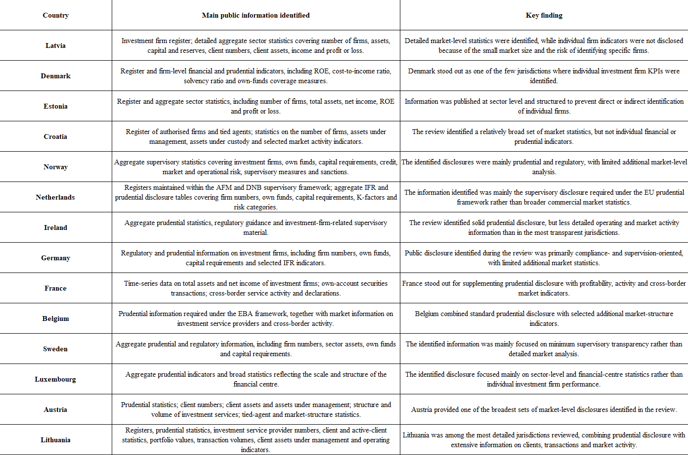
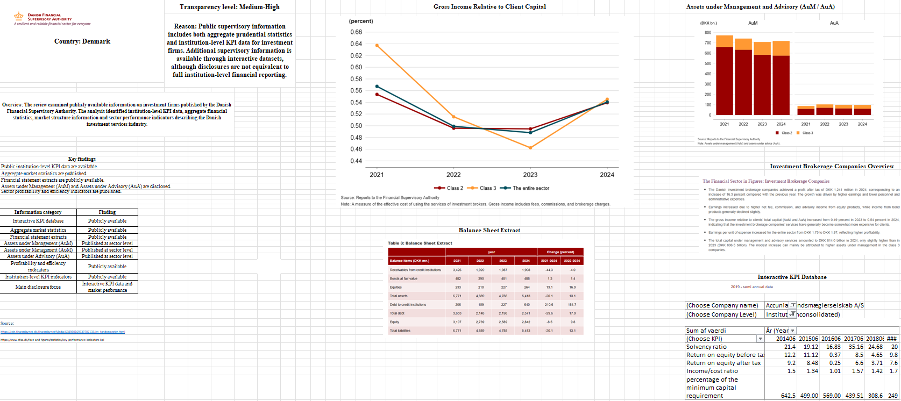

# EU Investment Firm Transparency Benchmark

Comparative analysis of publicly available investment firm disclosures across 14 European supervisory authorities.

## Project Overview

This project benchmarks the scope and transparency of publicly available information on investment firms across 14 European jurisdictions.

The analysis focuses on supervisory disclosures, prudential statistics, public investment firm registers, market-level information and the availability of institution-level financial and prudential indicators.

## Key Findings

- Aggregate prudential statistics were identified across all 14 jurisdictions reviewed.
- Public investment firm registers were available across all 14 jurisdictions.
- Institution-level KPI data were identified in only 2 of 14 jurisdictions.
- Disclosure practices differ substantially across jurisdictions, particularly in the availability of market statistics and institution-level indicators.

## Cross-Country Comparison

The jurisdictions were assessed based on the scope and depth of publicly available supervisory and market information.

## Country Analysis Example – Denmark

Denmark was one of the jurisdictions where institution-level financial and prudential indicators were identified, alongside broader market and supervisory statistics.

## Methodology

The analysis was based exclusively on publicly available information, including:

- supervisory authority websites
- prudential disclosures
- annual reports
- statistical publications
- public registers
- market and supervisory reports

## Tools

Microsoft Excel was used for data collection, structuring, comparative analysis and visualization.

## Disclaimer

This is an independent portfolio project based exclusively on publicly available information. The analysis reflects information identified during the review and should not be interpreted as confirmation that information not identified is unavailable elsewhere.
